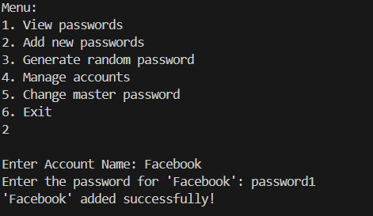
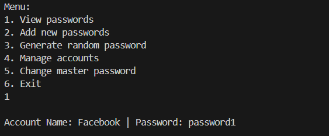

# 🔐 SecureVault

[](https://www.python.org/)
[]()
[](LICENSE)

SecureVault is a command-line password manager built with Python. It uses the `cryptography` library for AES-based encryption to securely store and manage account passwords. It includes features such as master password protection, encrypted storage, password generation, and basic account management.

---

## 🚀 Features

- 🔐 **Master Password Protection**
- 🔒 **AES Encryption** (via `cryptography.fernet`)
- 📂 **Add, View, Edit, Delete Accounts**
- 🔁 **Change Master Password**
- 🔑 **Random Password Generator**


## 🛠️ Installation

Make sure you have Python 3.10+ installed. Then install the required packages:

```bash
pip install cryptography
```

Clone this repository and run:

```bash
python secure_vault.py
```


## 💡 Usage

Once launched:
1. Set or enter the master password.
2. Choose from the menu:
   - View Passwords
   - Add new passwords
   - Generate random password
   - Manage account
   - Change master password
   - Exit

Passwords and master key are stored encrypted in local `.txt` and `.key` files.

## 📷 Screenshots

<p align="center">
  
  
</p>

<p align="center">
  <em>Password view and addition interface</em>
</p>

👉 For more screenshots, check the `screenshots/` folder.


## 📁 File Structure

```
📦 SecureVault
├── secure_vault.py
├── README.md
├── LICENSE
├── .gitignore
├── requirements.txt
└── screenshots/
```


## 📜 License

This project is licensed under the [MIT License](LICENSE).


## 👤 Author

**Muhammad Husnain Jatoi**  
[LinkedIn](https://www.linkedin.com/in/husnainjatoi) • [GitHub](https://github.com/husnainjatoi)
---
